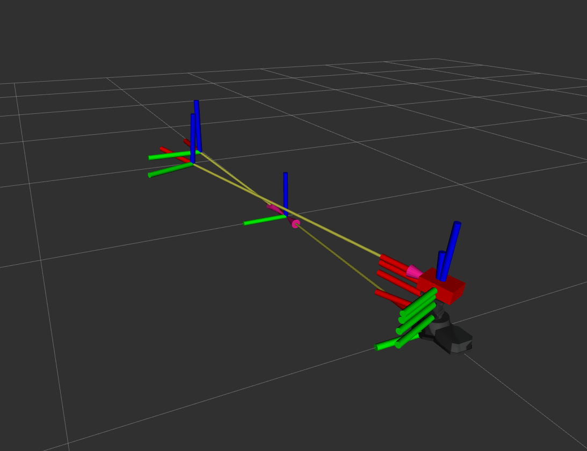

# Turret Aim Controller

This repository contains packages to control an Interbotix Pan & Tilt module to aim at a target transform.

## Install Interbotix Dependencies

Create an Interbotix workspace to clone and build the necessary packages to control the turret. This will be used as an underlayed workspace.

1. Choose one of the following depending on your system. This will install the [Interbotix ROS 2 interface](https://docs.trossenrobotics.com/interbotix_xsarms_docs/ros_interface/ros2/software_setup.html#software-installation) core packages and create a `interbotix_ws` directory.
- AMD64 Install

  ```
  sudo apt install curl
  curl 'https://raw.githubusercontent.com/Interbotix/interbotix_ros_manipulators/main/interbotix_ros_xsarms/install/amd64/xsarm_amd64_install.sh' > xsarm_amd64_install.sh
  chmod +x xsarm_amd64_install.sh
  ./xsarm_amd64_install.sh -d humble
  ```
  
- Raspberry Pi Install

  ```
  sudo apt install python3-pip
  
  sudo apt install curl
  curl 'https://raw.githubusercontent.com/Interbotix/interbotix_ros_manipulators/main/interbotix_ros_xsarms/install/rpi4/xsarm_rpi4_install.sh' > xsarm_rpi4_install.sh
  chmod +x xsarm_rpi4_install.sh
  ./xsarm_rpi4_install.sh -d humble
  ```

2. Install the Interbotix turret packages inside the `interbotix_ws/src`. Build the workspace in `interbotix_ws` using `colcon build`.

```
git clone -b humble https://github.com/Interbotix/interbotix_ros_turrets.git
```

3. Underlay the Interbotix workspace by sourcing it and build the workspace containing the `turret_aim_controller` packages using `colcon build`. 

```
. ~/interbotix_ws/install/setup.bash
colcon build
```

## Running the Packages

This basic demo will setup a virtual turret aiming at a circular rotating target. Make sure to create a new terminal and source the `install/setup.bash` before running any of these commands.

Spawn the turret in RViz.
```
ros2 launch turret_aim_control spawn_turret.launch.py
```

Spawn the moving target.
```
ros2 run turret_aim_control target
```

Call the aim enable service.
```
ros2 service call /aim_enable turret_aim_control_interfaces/srv/AimEnable {"aim_enable: true, target_frame_id: target"}
```

You should now see the turret aiming at the target.
<!--  -->


You can call this to stop it.
```
ros2 service call /aim_enable turret_aim_control_interfaces/srv/AimEnable {"aim_enable: false"}
```